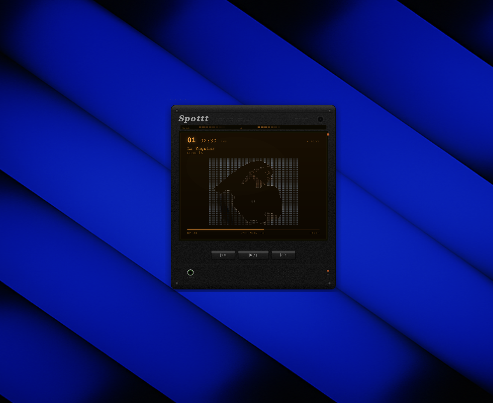

# Spottt

A retro Sony Discman-style desktop widget that displays your currently playing Spotify track as ASCII art.

Built with SVG hardware rendering, real-time Spotify sync, and the [ascii-art](https://github.com/neethanwu/ascii-art) conversion engine.



## Features

- **ASCII album covers** — converts album art to colored ASCII in real-time using 7 styles (braille, block, classic, edge, particles, retro-art, terminal)
- **Spotify sync** — polls the Spotify Web API for currently playing track, artist, album, and progress
- **Playback controls** — play/pause, next track, previous track directly from the widget
- **Retro hardware shell** — SVG-rendered Sony Discman-inspired device with amber LCD, peak level meter, brushed metal texture, and hardware details
- **Desktop widget** — frameless, transparent, always-on-top macOS window via pywebview
- **Artist fallback** — shows artist portrait when no album cover is available
- **Auto token refresh** — OAuth2 PKCE flow with persistent token storage

## Install

### macOS App (DMG)

Download the latest `.dmg` from [Releases](https://github.com/ar_gen_tin/spottt/releases), drag to Applications, and run.

### From Source

```bash
git clone https://github.com/ar_gen_tin/spottt.git
cd spottt
bash setup.sh
```

## Setup

1. Create a Spotify app at [developer.spotify.com/dashboard](https://developer.spotify.com/dashboard)
2. Set redirect URI to `http://127.0.0.1:8888/callback`
3. Copy your Client ID
4. Set the environment variable:

```bash
export SPOTIFY_CLIENT_ID="your_client_id_here"
```

## Usage

### Desktop Widget

```bash
python -m spottt.desktop.app
```

A retro Discman widget appears on your desktop. Play something on Spotify and the ASCII album cover renders on the amber LCD screen.

### Terminal Mode

```bash
python run.py
```

| Key | Action |
|-----|--------|
| `s` / `S` | Next / previous ASCII style |
| `+` / `-` | Increase / decrease art size |
| `q` | Quit |

## How It Works

1. Authenticates with Spotify via OAuth2 PKCE (no client secret needed)
2. Polls `/v1/me/player/currently-playing` every 3 seconds
3. Downloads album cover from Spotify CDN (`i.scdn.co`)
4. Converts image to ASCII art via the ascii-art pipeline (PIL → brightness grid → style mapping → ANSI colors)
5. Renders inside an SVG Discman shell via pywebview (native macOS WebKit)
6. Playback controls call Spotify Web API (`/v1/me/player/play`, `/pause`, `/next`, `/previous`)

## Art Styles

| Style | Description |
|-------|-------------|
| braille | Unicode braille dot patterns — highest detail |
| block | Unicode block elements — chunky retro pixels |
| classic | Density ramp ASCII characters |
| edge | Sobel edge detection outlines |
| particles | Sparse particle scatter |
| retro-art | CRT amber phosphor aesthetic |
| terminal | Green monochrome terminal |

## Requirements

- Python 3.9+
- macOS (pywebview uses WebKit)
- Spotify Premium account (for playback state access)
- Spotify Developer App (free, for Client ID)

## Dependencies

- [Pillow](https://pillow.readthedocs.io/) — image processing
- [numpy](https://numpy.org/) — array operations
- [pywebview](https://pywebview.flowrl.com/) — native desktop window
- [ascii-art](https://github.com/neethanwu/ascii-art) — image to ASCII conversion engine (bundled)

## License

MIT
